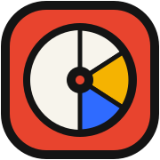
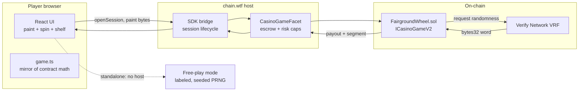

<div align="center">



# FAIRGROUND

**Paint your prizes. The wheel stays fair.**

A real-money on-chain casino game: the player paints the payout table of a provably uniform wheel. The contract recomputes every multiplier on-chain so the wheel returns exactly 96% however you paint.

[](https://fairground.sithunyein.com)
[](docs/MATH.md)
[](scripts/e2e-round.mjs)
[](#performance)
[](LICENSE)
[](https://jam.chain.wtf)

</div>

## What it is

Every casino wheel fixes the paytable and lets the house choose it. FAIRGROUND inverts that: the wheel is provably uniform, one VRF word per spin, rejection-sampled to an exactly even segment, and the player paints each slice safe, mid or risky before every spin. The Solidity contract derives the multipliers from the paint on-chain and pays out from them. The house cannot rig a paytable it does not set, and the player cannot buy odds: RTP is 96 percent for every legal paint, by construction.

Real money mode runs inside chain.wtf through the official casino SDK bridge: the player's vault balance, the host's bet limits, on-chain settlement. The guest follows the host's `ui.theme` snapshot, so it renders the dark booth inside a dark host app and keeps the light carnival identity everywhere it is opened directly. The same build opened standalone runs a labeled free-play mode, which is what the jam gallery and judges see.

## How the math stays honest

| Guarantee | Mechanism |
|---|---|
| Exactly uniform wheel | Rejection sampling: first VRF byte under floor(256/N)*N maps to byte mod N. No modulo bias. |
| RTP exactly 96% for any paint | Slices price as SAFE = 0.2x, MID = 2L, RISKY = 6L with L = (0.96N - 0.2 cSafe) / (2 cMid + 6 cRisky). One linear equation per paint. |
| Contract trusts nothing from the client | Multipliers are recomputed inside FairgroundWheel.sol from the 9-byte paint. The browser only mirrors the math for previews. |
| Cosmetics cannot touch payouts | Prize drops derive from leftover VRF bytes and are proven payout-invariant by test. |
| Verified | 300 of 300 legal composition classes price to exactly 96 percent, Monte Carlo over ~2M spins lands at 95.85 percent, and 3 of 3 end-to-end rounds settle on a live VRF node with payouts exact to the wei. Full detail in [docs/MATH.md](docs/MATH.md). |

## How the booth is laid out

The game is three screens, the way a game app is built rather than one long page. **PLAY** holds the wheel, the bet and the spin, with the last few results beside the LCD and a preview of your shelf that opens the album. **COLLECT** is the whole album: every prize in its set, each set naming the livery it pays out, with the season progress bar. **DAILY** is today's three objectives and the seven rung ladder.

On a wide screen the switcher is a segmented control under the header. On a phone it is a fixed bottom bar with thumb sized targets, the SPIN bar sits directly above it, and only the active screen is in the document, so nothing important is ever below the fold and no screen starts half scrolled. The tab badges carry live counts (prizes collected, objectives done), which is what gives a player a reason to leave the table.

## Devices

The layout is decided by two things: how wide the screen is, and how tall it is.

**One width breakpoint, at 660px.** Above it the table is side by side, wheel and controls together, the way a table should be. Below it the booth becomes a stacked app: wheel up top, the SPIN bar and the three screens pinned in the thumb zone, and only the active screen in the document. Between 660 and 860 the old layout used to stay stacked, which meant a tablet, a landscape phone and the 800x600 jam iframe all had a SPIN button below the bottom of the screen. Two columns from 660 up puts the wheel and the SPIN button on the same screen at every size that can fit both.

**Height matters too.** A wheel sized by width alone pushes the controls off a wide but short screen, which is the exact shape of the jam iframe. Above the phone breakpoint the wheel is therefore capped by height as well (`min(52vh, 430px)`), and on a viewport shorter than 560px the SPIN bar is pinned to the bottom of the window whatever the column count, so the button a player needs is never below the fold.

**Touch targets.** Desktop sizes are tuned for a cursor, so on any coarse pointer (including the touchscreen laptops that report a fine primary pointer) every control is raised to the 44px floor: presets, tier pills, icon buttons, the bet steppers, the first-run card's own controls, and the text actions under the bet. A viewport narrower than a laptop gets the same treatment, as a fallback for the touch devices whose pointer media query is missing or wrong.

**Instant standalone.** Opened directly, there is no host to wait for, so the game plays immediately instead of showing the connecting splash for the length of the handshake timeout. The handshake still runs, so an embed that arrives late still upgrades from demo to host with no reload.

Every one of those claims is measured, not assumed. `public/qa-viewports.html` loads the game in a same-origin iframe at ten viewports, from a 320px phone to a 1600px desktop, so the media queries genuinely re-evaluate, and reports per viewport: horizontal overflow, tap targets under 44px, the smallest rendered font, where SPIN and the nav land, how much scrolling the PLAY screen needs, and whether the first-run card fits. Open it on any running copy of the site (it is served at `/qa-viewports.html`) and read `window.__QA__`.

PLAY teaches the whole mechanic without a manual. Three **stake shapes** (Gentle, Standard, Wild) are legal by construction, so one tap gives a newcomer a sensible paint and shows the full risk range. A **price line** under the slices reads back the trade as you paint (`6 of 12 risky - risky pays 1.56x - RTP 96.00%`), which is the part of the design that is otherwise invisible: the more of the wheel you take risky, the less each risky slice pays, and the return never moves. A refused tap is never swallowed, it shakes the panel and says why. A three step **first loop** checklist (paint, spin, collect) retires itself once the loop has been played, and a collapsed **Why this stays fair** panel shows the current paint's counts, its multipliers and the command that proves the maths.

## Retention: the album and the daily booth

The spin is the core loop, not the whole game. Two systems sit on top of it, and both are strictly cosmetic.

**The prize album.** Every spin also drops a carnival toy from leftover VRF bytes: six toys across common, rare and legendary. The eighteen prizes are grouped into three sets of six, one per rarity, framed as Season 1 with a completion counter. Completing a set unlocks a wheel livery, and the seven day ladder ends in a gilded wheel. Rarity odds are 76.6 / 19.5 / 3.9 percent, so a set is a goal rather than a formality.

**The daily booth.** Three objectives rotate each day, chosen deterministically from a pool of eleven (spin volume, wins, risk appetite, a legendary drop, a completed set, sharing your wheel). The three never overlap: one per theme, so a day never asks for the same thing twice. Meeting all three banks the day and climbs a seven rung ladder of stamps, with consecutive days required and a missed day sending the run back to rung one.

Neither system can touch a multiplier, a payout or an outcome. `src/lib/missions.ts` is pure logic that never reads the game maths or the balance, and `npm run verify:missions` asserts that property alongside the board rules, so a future edit cannot quietly turn a cosmetic into an edge.

## Architecture



The instant game shape keeps the SDK surface minimal: open session, wait for randomness, settle. No player actions mid-round, nothing to time out.

## Project structure

```text
fairground/
├── contract/
│   └── FairgroundWheel.sol     ICasinoGameV2 game: paint validation, pricing, settlement
├── src/
│   ├── chain-sdk/              Vendored SDK types, guest bridge, bet limit helper
│   ├── components/
│   │   ├── Wheel.tsx           Paintable SVG wheel, spin physics, peg-flex pointer
│   │   └── Prizes.tsx          Pixel prize sprites, boot wheel, brand mark
│   ├── lib/
│   │   ├── game.ts             Shared math, exact mirror of the contract
│   │   ├── collection.ts       Prize shelf, sets, liveries (localStorage)
│   │   ├── missions.ts         Daily objectives + seven day ladder (pure logic)
│   │   ├── sound.ts            WebAudio synth kit, zero audio assets
│   │   └── useCasinoHost.ts    Bridge hook: host mode, demo fallback, resume
│   ├── App.tsx                 Booth UI, bet flow, stats, missions, album
│   ├── main.tsx                Entry + crash boundary
│   └── styles/fairground.css   Design system
├── scripts/
│   ├── verify-rtp.mjs          Exhaustive class sweep + Monte Carlo proof
│   ├── verify-missions.mjs     37 rule checks: boards, banking, ladder, cosmetics
│   └── e2e-round.mjs           Full bet-VRF-settle round vs the local simulator
├── public/
│   ├── game.manifest.json      SDK manifest
│   └── icon-180.png.svg        Brand mark
├── docs/MATH.md                Declared math, full derivation and test report
├── index.html                  Jam widget, meta, fonts
└── LICENSE                     MIT
```

## Security

- **Fairness is auditable in minutes.** One VRF word, one rejection-sampling loop, one linear pricing equation. The contract comments walk a reviewer through every step, and the settle-time reserved-profit rule (the classic instant-game trap) is documented where it bites.
- **No keys, no wallets, no signatures in the client.** The browser holds no secrets and never talks to a chain directly in host mode; the SDK bridge and the host's facet handle escrow and settlement.
- **Every input is validated on-chain.** Segment count, tier values, paint legality and the 16x multiplier cap all revert in the contract; illegal states are unreachable, not just hidden in the UI.
- **Light tail by design.** The heaviest legal paint pays about 12.4x with a risky win probability of at least 1/16, comfortably inside the platform's heavy-tail thresholds.
- **Cosmetics are non-financial.** Collection state lives in localStorage and cannot alter any payout, proven by test.
- **Crash containment.** A render-level error boundary keeps a broken session from white-screening; player state survives in storage.

Report anything suspicious by opening a GitHub issue or reaching out on the Chain Jam Discord.

## Performance

66 KB gzipped total, zero runtime image assets (the game is drawn entirely in SVG and CSS, audio is synthesized in the browser), self-hosted font subsets and no third-party requests of any kind. The game paints its first frame before most sites finish their font fetch. The only PNGs in the repo are the favicon, the social card and the catalog icon and cover declared in `game.manifest.json`, none of which block the first frame. Designed to load near-instantly on mobile data, which the jam checks.

## Development

```bash
npm install
npm run dev            # http://localhost:3120, standalone free-play mode
npm run verify:rtp     # exhaustive RTP proof, all legal paints
npm run verify:missions # daily objectives, banking and the seven day ladder
npm run build          # production build to dist/

# full on-chain loop: start the casino SDK simulator, then
node scripts/e2e-round.mjs
```

The contract hot-deploys into the SDK simulator: drop it in `simulator/contracts/`, the local node compiles, deploys, registers, and the bundled VRF node fulfills requests.

## License

[MIT](LICENSE) (c) Sithu Nyein
