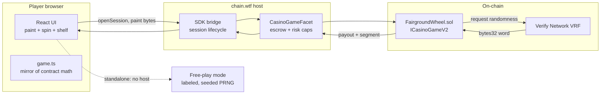

<div align="center">


# FAIRGROUND

**Paint your prizes. The wheel stays fair.**

A real-money on-chain casino game: the player paints the payout table of a provably uniform wheel. The contract recomputes every multiplier on-chain so the wheel returns exactly 96% however you paint.

[](https://fairground.sithunyein.com)
[](docs/MATH.md)
[](scripts/e2e-round.mjs)
[](#performance)
[](LICENSE)
[](https://jam.chain.wtf)

</div>

## What it is

Every casino wheel fixes the paytable and lets the house choose it. FAIRGROUND inverts that: the wheel is provably uniform, one VRF word per spin, rejection-sampled to an exactly even segment, and the player paints each slice safe, mid or risky before every spin. The Solidity contract derives the multipliers from the paint on-chain and pays out from them. The house cannot rig a paytable it does not set, and the player cannot buy odds: RTP is 96 percent for every legal paint, by construction.

Real money mode runs inside chain.wtf through the official casino SDK bridge: the player's vault balance, the host's bet limits, on-chain settlement. The same build opened standalone runs a labeled free-play mode, which is what the jam gallery and judges see.

## How the math stays honest

| Guarantee | Mechanism |
|---|---|
| Exactly uniform wheel | Rejection sampling: first VRF byte under floor(256/N)*N maps to byte mod N. No modulo bias. |
| RTP exactly 96% for any paint | Slices price as SAFE = 0.2x, MID = 2L, RISKY = 6L with L = (0.96N - 0.2 cSafe) / (2 cMid + 6 cRisky). One linear equation per paint. |
| Contract trusts nothing from the client | Multipliers are recomputed inside FairgroundWheel.sol from the 9-byte paint. The browser only mirrors the math for previews. |
| Cosmetics cannot touch payouts | Prize drops derive from leftover VRF bytes and are proven payout-invariant by test. |
| Verified | 300 of 300 legal composition classes price to exactly 96 percent, Monte Carlo over ~2M spins lands at 95.85 percent, and 3 of 3 end-to-end rounds settle on a live VRF node with payouts exact to the wei. Full detail in [docs/MATH.md](docs/MATH.md). |

## Architecture



The instant game shape keeps the SDK surface minimal: open session, wait for randomness, settle. No player actions mid-round, nothing to time out.

## Project structure

```text
fairground/
├── contract/
│   └── FairgroundWheel.sol     ICasinoGameV2 game: paint validation, pricing, settlement
├── src/
│   ├── chain-sdk/              Vendored SDK types, guest bridge, bet limit helper
│   ├── components/
│   │   ├── Wheel.tsx           Paintable SVG wheel, spin physics, peg-flex pointer
│   │   └── Prizes.tsx          Pixel prize sprites, boot wheel, brand mark
│   ├── lib/
│   │   ├── game.ts             Shared math, exact mirror of the contract
│   │   ├── collection.ts       Prize shelf, sets, liveries (localStorage)
│   │   ├── sound.ts            WebAudio synth kit, zero audio assets
│   │   └── useCasinoHost.ts    Bridge hook: host mode, demo fallback, resume
│   ├── App.tsx                 Booth UI, bet flow, stats, milestones
│   ├── main.tsx                Entry + crash boundary
│   └── styles/fairground.css   Design system
├── scripts/
│   ├── verify-rtp.mjs          Exhaustive class sweep + Monte Carlo proof
│   └── e2e-round.mjs           Full bet-VRF-settle round vs the local simulator
├── public/
│   ├── game.manifest.json      SDK manifest
│   └── icon-180.png.svg        Brand mark
├── docs/MATH.md                Declared math, full derivation and test report
├── index.html                  Jam widget, meta, fonts
└── LICENSE                     MIT
```

## Security

- **Fairness is auditable in minutes.** One VRF word, one rejection-sampling loop, one linear pricing equation. The contract comments walk a reviewer through every step, and the settle-time reserved-profit rule (the classic instant-game trap) is documented where it bites.
- **No keys, no wallets, no signatures in the client.** The browser holds no secrets and never talks to a chain directly in host mode; the SDK bridge and the host's facet handle escrow and settlement.
- **Every input is validated on-chain.** Segment count, tier values, paint legality and the 16x multiplier cap all revert in the contract; illegal states are unreachable, not just hidden in the UI.
- **Light tail by design.** The heaviest legal paint pays about 12.4x with a risky win probability of at least 1/16, comfortably inside the platform's heavy-tail thresholds.
- **Cosmetics are non-financial.** Collection state lives in localStorage and cannot alter any payout, proven by test.
- **Crash containment.** A render-level error boundary keeps a broken session from white-screening; player state survives in storage.

Report anything suspicious by opening a GitHub issue or reaching out on the Chain Jam Discord.

## Performance

62 KB gzipped total, zero image assets (everything is SVG or CSS), synthesized audio, self-hosted nothing: the game paints its first frame before most sites finish their font fetch. Designed to load near-instantly on mobile data, which the jam checks.

## Development

```bash
npm install
npm run dev            # http://localhost:3120, standalone free-play mode
npm run verify:rtp     # exhaustive RTP proof, all legal paints
npm run build          # production build to dist/

# full on-chain loop: start the casino SDK simulator, then
node scripts/e2e-round.mjs
```

The contract hot-deploys into the SDK simulator: drop it in `simulator/contracts/`, the local node compiles, deploys, registers, and the bundled VRF node fulfills requests.

## License

[MIT](LICENSE) (c) Sithu Nyein
